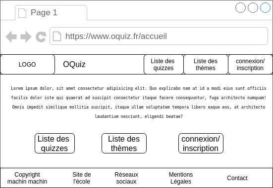
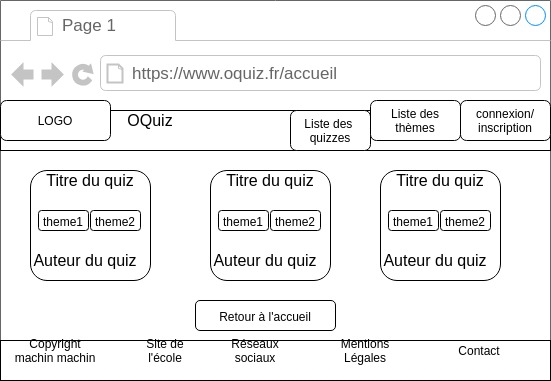

# Outils pour faire des wireframes

Un wireframe est une représentation très schématique d'une page du site afin de déterminer et positionner (grossièrement) les différents blocks qui devront y apparaitre

- papier crayon
- wireframe.cc
- excalidraw
- app.diagrams.net
- paint
- whimsical
- ...

## Page d'accueil

## Liste des quizzes

